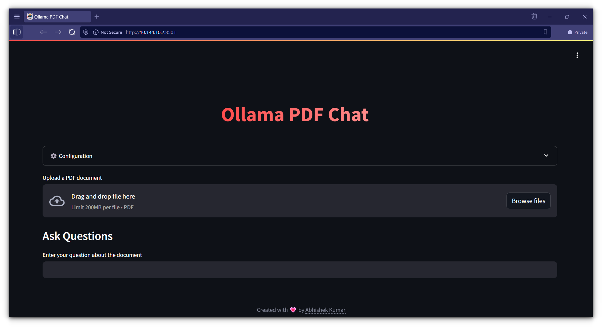
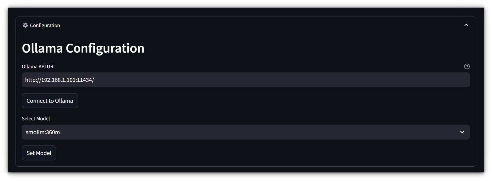
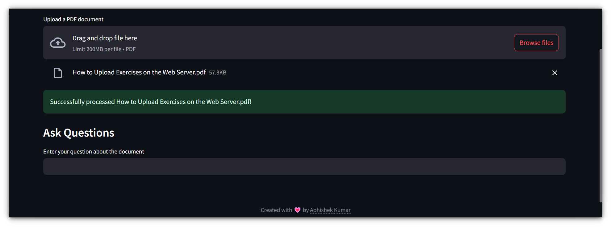
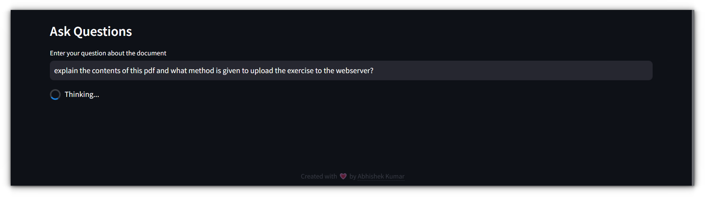

# Local RAG System

A local Retrieval-Augmented Generation (RAG) system built with Streamlit, LangChain, and Ollama. This system allows you to upload PDF documents and ask questions about their content, with all processing happening locally on your machine.



> ⚠️ **WARNING**: This project is currently in a highly active development phase.  Please be aware that the responses generated by this system may not always be accurate or reliable. Use it with caution and at your own discretion.

## Features

- 🚀 Easy-to-use Streamlit web interface
- 🔒 Fully local processing - no data leaves your machine
- 📄 PDF document processing and embedding
- 💡 Configurable Ollama model selection
- 🔍 Semantic search and context-aware responses
- 🐳 Docker support for easy deployment

## Prerequisites

- [Ollama](https://ollama.com/) installed and running
- Docker and Docker Compose (if using Docker)

## Quick Start with Docker

1. Clone the repository:
   
   ```bash
   git clone https://github.com/itsfoss/ollama-pdf-chat.git
   cd ollama-pdf-chat
   ```

2. Start the application using Docker Compose:
   
   ```bash
   docker compose up -d --build
   ```

3. Open your browser and navigate to:
   
   ```
   http://localhost:8501
   ```

## Manual Installation

1. Clone the repository:
   
   ```bash
   git clone https://github.com/itsfoss/ollama-pdf-chat.git
   cd ollama-pdf-chat
   ```

2. Create and activate a virtual environment:
   
   ```bash
   python -m venv venv
   source venv/bin/activate  # On Windows: venv\Scripts\activate
   ```

3. Install dependencies:
   
   ```bash
   pip install -r requirements.txt
   ```

4. Start Ollama:
   
   ```bash
   ollama serve
   ```

5. Run the Streamlit app:
   
   ```bash
   streamlit run src/streamlit_app.py
   ```

## Usage

1. **Configure Ollama**:
   
   - Enter your Ollama URL (default: http://localhost:11434)
   - Click "Connect to Ollama"
   - Select your preferred model from the dropdown

1. **Upload Documents**:
      
   - Click the "Choose a PDF file" button
   - Select your PDF document
   - Click "Process PDF" to embed the document

1. **Ask Questions**:
      
   - Type your question in the text area
   - Click "Ask" or press "Enter" to get an AI-generated response based on your documents

## Project Structure

```
.
├── src/
│   ├── streamlit_app.py    # Main Streamlit application
│   ├── config.py           # Ollama configuration
│   ├── embed.py           # Document embedding logic
│   ├── query.py           # Query processing
│   └── get_vector_db.py   # Vector database management
├── docker-compose.yml
├── Dockerfile
├── setup.py
└── README.md
```

## Environment Variables

- `TEMP_FOLDER`: Directory for temporary file storage (default: `./_temp`)
- `PERSIST_DIRECTORY`: Directory for ChromaDB vector database (default: `./_vectors`)

## Contributing

Contributions are welcome! Please feel free to submit a Pull Request.

